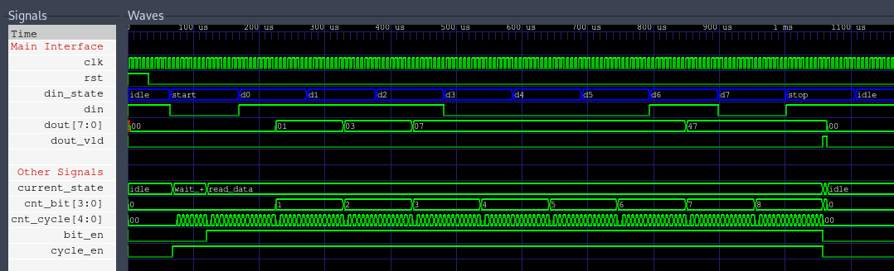
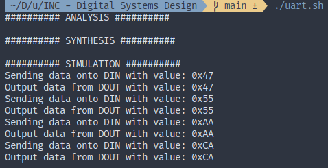
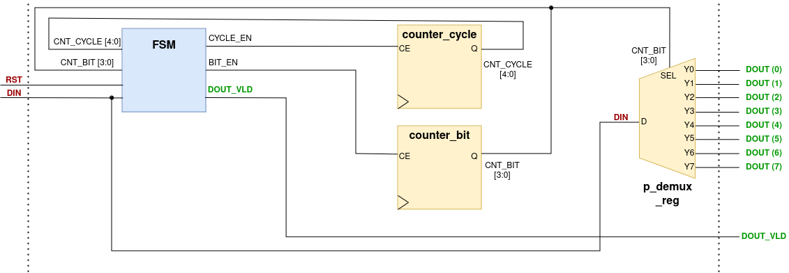
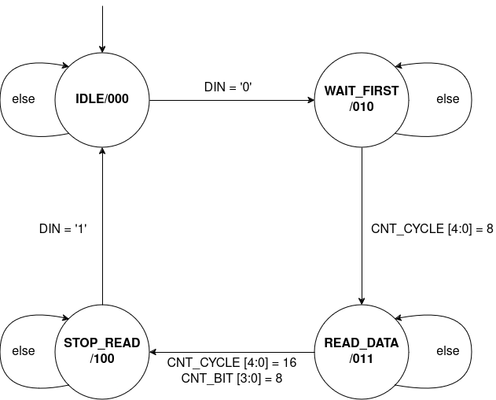

# Circuit design

### Description

Implementation of a circuit for receiving data

### Result

 

### Architecture of the designed circuit at the RTL level

> **_NOTE:_** Details can be found in file zprava.pdf

### Finite State Machine

> **_NOTE:_** Details can be found in file zprava.pdf

